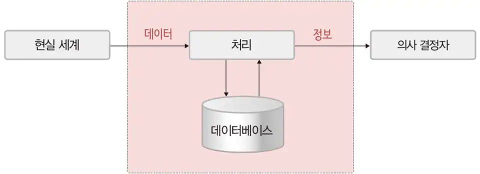
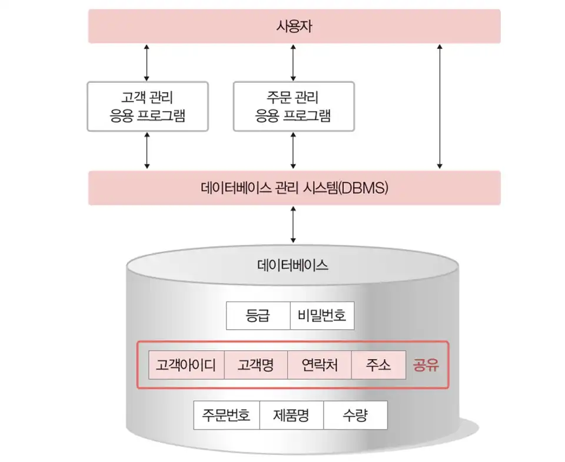
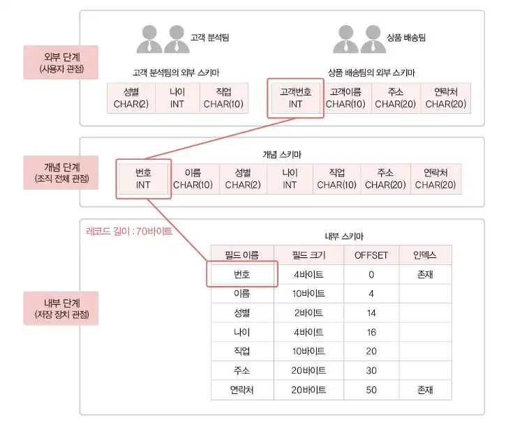
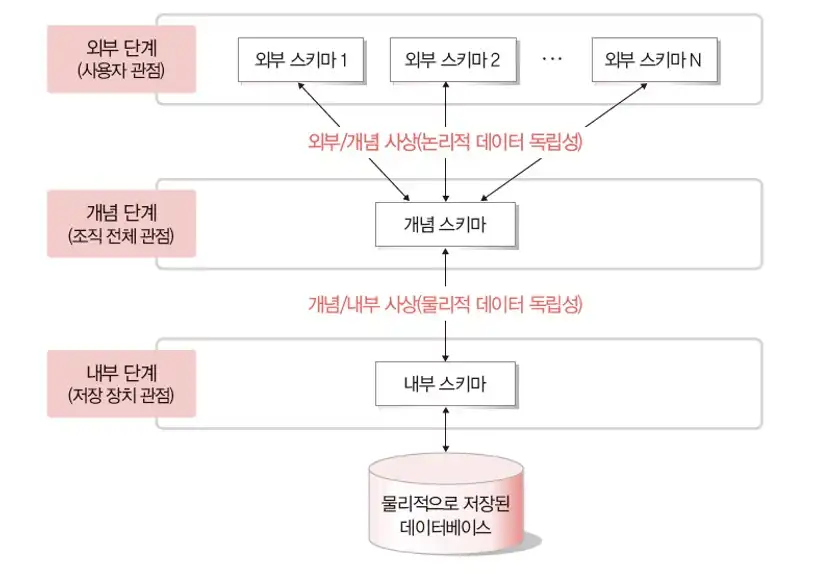
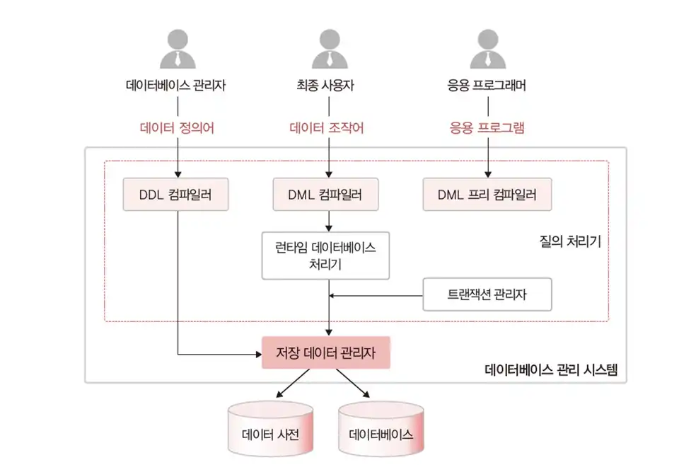

# 데이터베이스 기본 개념

## 데이터베이스의 필요성

데이터를 정의하시오

    

        현실 세계에서 단순히 관찰하거나 측정하여 수집한 사실fact이나 값value
    

정보를 정의하시오

    

        데이터를 의사 결정에 유용하게 활용할 수 있도록 처리해 체계적으로 조직한 결과물
    

정보 처리Information Processing를 정의하시오

    

        데이터를 상황에 맞게 분석하거나 해석해 데이터 간의 의미 관계를 파악할 수 있도록 데이터에서 정보를 추출하는 과정 또는 방법
    

정보 시스템Information System을 정의하시오

    

        의사 결정이 필요할 때 데이터를 처리해 유용한 정보를 만들어주는 수단
    

    

        
    

정보 시스템의 종류를 나열하시오

    <ul>
        <li>경영 정보 시스템MIS; Management Information System</li>
        <li>의사 결정 지원 시스템DSS; Decision Support System</li>
    </ul>

 

## 데이터 베이스의 정의와 특징

데이터베이스DB; DataBase를 정의하시오

    

        특정 조직의 여러 사용자가 공유shared하여 사용할 수 있도록 통합integrated해서 저장stored한 운영operational 데이터의 집합
    

데이터베이스의 특징을 나열하시오

    <ul>
        <li>실시간 접근real-time accessibility이 가능하다</li>
        <li>계속 변화continuous evolution한다</li>
        <li>동시 공유concurrent sharing가 가능하다</li>
        <li>내용으로 참조content reference가 가능하다</li>
    </ul>

 

## 데이터와 데이터베이스

정형 데이터structured data를 정의하고 예시를 나열하시오

    

        미리 정해진 구조schema에 따라 저장한 데이터이다.
    

    정형 데이터의 예시로 다음을 들 수 있다.
    <ul>
        <li>엑셀의 스프레드시트</li>
        <li>관계 데이터베이스의 테이블</li>
    </ul>

반정형 데이터semi-structured data를 정의하고 예시를 나열하시오

    

        구조에 따라 저장하지만 정형 데이터와 달리 데이터 내용 안에 구조에 대한 설명이 함께 존재하는 데이터
    

    반정형 데이터의 예시로 다음을 들 수 있다.
    <ul>
        <li>HTML</li>
        <li>XML</li>
        <li>JSON</li>
        <li>웹 로그</li>
        <li>센서 데이터</li>
    </ul>

비정형 데이터unstructured data를 정의하고 예시를 나열하시오

    

        정해진 구조 없이 저장한 데이터
    

    비정형 데이터의 예시로 다음을 들 수 있다.
    <ul>
        <li>쇼셜 데이터의 텍스트, 영상, 이미지</li>
        <li>워드, PDF 문서와 같은 멀티미디어 데이터</li>
    </ul>

  

# 데이터베이스 관리 시스템

## 데이터베이스 관리 시스템의 등장 배경

파일 시스템file system을 정의하시오

    

        오래 전부터 사용한 정보 처리 시스템, 데이터를 파일로 관리할 수 있도록 파일을 생성·삭제·수정·검색하는 기능을 제공하며 운영체제와 함께 설치
    

파일 시스템의 장점을 나열하시오

    <ul>
        <li>별도의 구매 비용이 들지 않는다</li>
    </ul>

파일 시스템의 단점을 나열하시오

    <ul>
        <li>
            같은 내용의 데이터를 여러 파일에 중복 저장한다.
            

                따라서 데이터 중복성redundancy 문제가 발생한다. 저장 공간 낭비를 초래하며 데이터 일관성consistency과 무결성integrity을 유지하기 어렵다.
            

        </li>
        <li>
            응용 프로그램이 데이터 파일에 종속한다.
            

                사용하는 파일의 구조를 변경하면 응용 프로그램도 함께 변경해야 하는 데이터 종속성dependency이 발생한다.
            

        </li>
        <li>
            데이터 파일에 대한 동시 공유, 보안, 회복 기능이 부족하다.
            

                둘 이상의 응용프로그램이 동시 접근해 사용할 수 없다. 파일 안의 레코드나 필드 같은 작은 단위에 대한 접근 통제와 권한 분여가 없다. 응용프로그램이 파일을 사용하는 도중 장애 발생시 일관된 상태로 회복하기 어렵다. 특히 데이터를 수정하는 도중이었다면 더욱 어렵다.
            

        </li>
        <li>
            응용 프로그램을 개발하기 쉽지 않다.
            

                파일 시스템에서 파일을 접근하여 데이터를 관리하는 모든 작업을 응용 프로그램이 담당한다. 파일에서 데이터 읽기/삽입/삭제 등 기본적인 데이터 관리 기능을 모두 포함해야하는 응용 프로그램을 개발하는 데 어려움이 많다.
            

        </li>
    </ul>

 

## 데이터베이스 관리 시스템의 정의

데이터베이스 관리 시스템을 정의하시오

    

        조직에 필요한 데이터를 데이터베이스에 통합하여 저장하고 삽입·삭제·수정·검색하고, 모든 응용 프로그램이 공유할 수 있도록 관리하는 소프트웨어이다.
    

    

        
    

데이터베이스 관리 시스템의 주요 기능을 나열하시오

    <ul>
        <li>
            정의 기능
            

                데이터베이스 구조를 정의·수정 할 수 있다.
            

        </li>
        <li>
            조작 기능
            

                데이터를 삽입·삭제·수정·검색 연산을 수행할 수 있다.
            

        </li>
        <li>
            제어 기능
            

                데이터를 항상 정확하고 안전하게 유지할 수 있다. 데이터를 조작하면서 일관성과 무결성을 유지하고 장애 발생시 회복이 가능하며 권한있는 사용자에게만 데이터 접근을 허용하는 보안 유지의 기능을 가진다. 특히 여러 사용자가 데이터에 동시 접근해 데이터를 처리할 수 있도록 제어한다.
            

        </li>
    </ul>

 

## 데이터베이스 관리 시스템의 장단점

데이터베이스 관리 시스템의 장점을 나열하시오

    <ul>
        <li>
            데이터 중복 최소화
            

                데이터베이스는 데이터를 통합해서 관리함으로써 파일 시스템의 단점 중 하나인 자료의 중복과 데이터의 중복성 문제를 해결할 수 있다.
            

        </li>
        <li>
            데이터 독립성
            

                데이터베이스 구조를 변경하여도 응용 프로그램이 영향을 받지 않는다. 즉, 응용 프로그램과 데이터베이스 사이의 독립성을 확보할 수 있다.
            

        </li>
        <li>
            데이터 동시 공유
            

                데이터베이스에 통합한 데이터를 여러 응용 프로그램이 공유하여 같은 데이터에 동시 접근할 수 있도록 지원한다.
            

        </li>
        <li>
            강력한 데이터 보안
            

                데이터를 중앙 집중식으로 관리하므로 데이터에 대한 효율적인 접근 제어가 가능하다. 권한이 없는 사용자의 접근, 허용하지 않은 데이터와 연산에 대한 요청을 사전에 차단할 수 있다. 그리고 사용자별로 접근 가능한 데이터베이스 영역을 제한하거나 접근 수준을 차별화할 수 있다.
            

        </li>
        <li>
            데이터 무결성 유지
            

                데이터에 대한 연산을 수행할 때마다 유효성을 검사하여 데이터 무결성을 유지할 수 있도록 한다.
            

        </li>
        <li>
            표준화
            

                모든 응용 프로그램은 데이터베이스 관리 시스템이 정한 표준화 방식을 통해 데이터베이스에 접근한다.
            

        </li>
        <li>
            회복 기능
            

                장애가 발생해도 데이터 일관성과 무결성을 유지하면서 데이터를 장애가 발생하기 이전 상태로 복구하는 회복 기능을 지원한다.
            

        </li>
        <li>
            응용 프로그램 개발 비용 절약
            

                데이터에 대한 모든 관리를 DBMS가 담당하기에 파일 시스템에 비해 응용 프로그램 개발 비용이 적게 든다. 데이터베이스 구조를 변경해도 응용 프로그램은 변경할 필요가 없어 유지 보수 비용 또한 비교적 적다.
            

        </li>
    </ul>

데이터베이스 관리 시스템의 단점을 나열하시오

    <ul>
        <li>비용이 많이 든다.</li>
        <li>백업과 회복의 방법이 복잡하다.</li>
        <li>중앙 집중 관리로 인한 취약점이 있다.</li>
    </ul>

 

## 데이터베이스 관리 시스템의 발전 과정

데이터베이스 관리 시스템의 종류를 나열하고 각각의 특징을 서술하시오

    <ul>
        <li>
            네트워크 DBMS
            

                데이터베이스를 노드와 간선을 이용한 그래프 형태로 구성하는 네트워크 데이터 모델을 사용하는 DBMS, 데이터베이스 구조가 복잡하고 변경하기 어렵다. IDSIntegrated Data Store가 대표적인 예시이다.
            

        </li>
        <li>
            계층 DBMS
            

                데이터베이스를 트리 형태로 구성하는 계층 데이터 모델을 사용하는 DBMS, 복잡한 현실 세계의 모습을 부모 자식 관계가 명확한 트리 형태로 표현하기 힘들고 구조 변경이 어렵다는 문제가 있다. IMSInformation Management Sysmsem이 대표적인 예시이다.
            

        </li>
        <li>
            관계 DBMS
            

                데이터베이스를 테이블 형태로 구성하는 관계 데이터 모델을 사용하는 DBMS, 단순하고 이해하기 쉬운 구조의 데이터베이스를 사용한다는 것이 장점이다. Oracle, MS SQL Server, MySQL, Access, Informix 들이 대표적인 예시이다.
            

        </li>
        <li>
            객체지향 DBMS
            

                객체 개념을 이용해 데이터베이스를 구성하는 객체 데이터 모델을 사용하는 DBMS, 복잡한 응용 분야의 데이터를 관리하려는 사용자의 요구를 충족하기 위해 객체지향 DBMS를 제안했다. 새로운 유형의 데이터를 저장, 복잡한 분석 및 처리를 지원한다. O2, ONTOS, GemStone 들이 대표적인 예시이다.
            

        </li>
        <li>
            객체관계 DBMS
            

                관계 데이터 모델에 객체지향 개념을 도입한 객체관계 데이터 모델을 사용하는 DBMS, 객체 DBMS와 관계 DBMS의 통합한 것이라 여길 수 있다.
            

        </li>
        <li>
            NoSQL DBMS
            

                데이터 구조를 미리 정해두지 않은 DBMS, 비정형 데이터를 저장·처리하는데 적합하며 확장성이 뛰어나 여러 대의 서버 컴퓨터에 데이터를 분산·저장·처리하는 환경에서 주로 사용한다. 1998년에 처음 언급되었으나 Not Only SQL의 약자로 관계 DBMS을 적용하기 어려운 환경에서 선택할 수 있는 대안으로서의 의미를 가지게 된 것은 2009년 이후부터다. NoSQL에서 SQL은 관계 DBMS을 의미하는 것으로 생각하면 이해하기 쉽다. MongoDB, HBase, Cassandra, Redis, Neo4j, OrientDB 들이 대표적인 예시이다.
            

        </li>
        <li>
            NewSQL DBMS
            

                안정성과 일관성을 유지하면서도 SQL을 이용해 다양하고 복잡한 데이터 처리를 편리하게 요청할 수 있다. 즉, 관계 DBMS의 장점과 NoSQL의 확장성 및 유연성을 모두 지원한다. 따라서 정형 및 비정형 데이터를 안정적이고 빠르게 처리할 수 있다. Spanner, VoltDB, NuoDB 들이 대표적인 예시이다.
            

        </li>
    </ul>

4세대 데이터 베이스 관리 시스템NoSQL, NewSQL이 등장하게 된 계기를 설명하시오

    

        많은 사람들의 소셜 네트워크 서비스SNS;Social Network Service를 이용하면서 사진, 동영상, 검색 로그와 같은 비정형 데이터를 대량으로 발생했다. 관계 DBMS는 빠른 속도로 증가하는 대량의 비정형 데이터를 처리하는 데는 비효율적이므로 관계 DBMS를 그대로 유지하면서 CPU나 메모리와 같은 하드웨어 장치의 성능을 향상하는 것만으로는 문제를 해결할 수 없기에 등장하였다.
    

  

# 데이터베이스 시스템

## 데이터베이스 시스템의 정의

데이터베이스 시스템DBS; DataBase System을 정의하시오

    

        데이터베이스에 데이터를 저장하고 관리하여 조직에 필요한 정보를 생성해주는 시스템이다.
    

    데이터베이스 시스템은 다음을 이용해 구성한다.
    <ul>
        <li>사용자</li>
        <li>데이터 언어SQL</li>
        <li>
            컴퓨터
            <ul>
                <li>데이터베이스</li>
                <li>데이터베이스 관리 시스템</li>
            </ul>
        </li>
    </ul>

 

## 데이터베이스의 구조

스키마schema를 정의하시오

    

        데이터베이스에 저장하는 데이터 구조와 제약조건이다.
    

3단계 데이터베이스 구조를 설명하시오

    <ol>
        <li>
            외부 단계external level
            

                개별 사용자 관점에서 데이터베이스를 이해하고 표현한다. 개별 사용자가 데이터베이스를 어떻게 보는가를 표현하므로 사용자마다 생각하는 데이터베이스의 구조가 다르다. 이처럼 외부 단계에서 사용자에게 필요한 데이터베이스 논리적인 구조를 표현한 것을 외부 스키마external schema라 한다. 전체 데이터베이스 중 사용자가 관심을 가지는 일부를 볼 수 있어 서브 스키마sub schema라고도 한다.
            

        </li>
        <li>
            개념 단계conceptual level
            

                데이터베이스를 이용하는 사용자들의 관점을 통합해 데이터베이스를 조직 전체의 관점에서 이해하고 표현한다. 전체 데이터베이스에 어떤 데이터가 저장되는지, 데이터들 간에는 어떤 관계가 존재하고 어떤 제약조건이 있는지에 대한 정의뿐만 아니라 데이터에 대한 보안 정책이나 접근 권한에 대한 정의도 포함한다. 이 관점에서 데이터베이스를 정의한 것을 개념 스키마conceptual schema라고 한다. 데이터베이스 하나에는 단 하나의 개념스키마가 존재한다. 일반적으로 스키마라고 하면 개념 스키마를 의미한다.
            

        </li>
        <li>
            내부 단계internal level
            

                데이터베이스를 디스크나 테이프 같은 저장 장치의 관점에서 이해하고 표현한다. 이 관점에서 데이터베이스를 정의한 것을 내부 스키마internal schema라 한다. 데이터베이스를 저장 장치에 파일 형태로 저장하는데 파일에 데이터를 저장하는 레코드의 구조, 레코드를 구성하는 필드의 크기, 인덱스를 이용한 레코드 접근 경로 등을 정의한다. 내부 스키마는 데이터베이스의 개념 스키마에 대한 물리적인 저장 구조를 표현하므로 하나의 데이터베이스에 하나만 존재한다.
            

        </li>
    </ol>
    

        
    

데이터 독립성data independency을 정의하시오

    

        하위 스키마를 변경하더라도 상위 스키마가 영향을 받지 않는 특성이다. 3단계 데이터베이스 구조에는 논리적 데이터 독립성과 물리적 데이터 독립성이 존재하고 각각 외부/개념 사상, 개념/내부 사상으로 독립성을 유지한다. 논리적 데이터 독립성은 개념 스키마을 변경하더라도 외부 스키마가 영향을 받지 않는 것이다. 외부/개념 사상은 외부 스키마와 개념 스키마의 대응 관계를 정의한 것으로 응용 인터페이스application interface라고도 한다. 물리적 데이터 독립성은 내부 스키마를 변경하더라도 개념 스키마가 영향을 받지 않는 것이고 따라서 외부 스키마도 영향을 받지 않는다. 개념/내부 사상은 개념 스키마와 내부 스키마의 대응 관계를 정의한 것으로 저장 인터페이스storage interface라고도 한다.
    

    

        
    

데이터베이스에서 데이터 독립성을 실현하기 위한 조건을 설명하시오

    

        단계별로 스키마를 유지하며 스키마 사이의 대응 관계를 정의하는 것이 데이터 독립성을 실현할 수 있다. 즉, 외부/개념 사상을 통해 논리적 데이터 독립성을 실현하고 개념/내부 사상으로 물리적 데이터 독립성을 실현한다면 데이터 독립성을 실현할 수 있다.
    

데이터 사전data dictionary을 정의하고 설명하시오

    

        데이터베이스에 저장하는 데이터의 정보를 저장하는 곳이다. 시스템 카탈로그system catalog 또는 메타 데이터meta data라고 칭하기도 한다. 데이터 사전도 데이터를 저장하는 데이터베이스의 일종이기 때문에 시스템 데이터베이스system database라고도 칭한다. 이와 구별하기 위해 사용자가 주로 이용하는 데이터를 저장하는 일반 데이터베이스를 사용자 데이터베이스user database라고 칭하기도 한다.
    

    

        데이터베이스 관리 시스템은 데이터 사전에 내용 추가/수정이 가능하다. 사용자는 내용 검색만 가능하다.
    

    데이터 사전은 다음을 포함한다.
    <ul>
        <li>스키마</li>
        <li>사상 정보</li>
        <li>다양한 제약 조건</li>
    </ul>

데이터 디렉터리data directory를 정의하시오

    

        데이터 사전에 있는 데이터에 실제로 접근하는 데 필요한 위치 정보를 관리한다. 데이터 디렉터리는 시스템만이 접근할 수 있다.
    

 

## 데이터베이스 사용자

데이터베이스 관리자DBA; DataBase Administrator를 정의하시오

    

        데이터베이스 시스템을 운영과 관리를 하는 사용자이다. 조직 내의 사용자를 위해 데이터베이스를 설계 및 구축하고 제어한다. 데이터 언어 중 데이터 정의어와 데이터 제어어를 주로 이용한다. 큰 조직에서는 데이터베이스 설계 업무만 담당하는 데이터베이스 설계자database designer를 따로 두기도 한다.
    

    데이터베이스 관리자의 주요 업무는 다음과 같다.
    <ul>
        <li>
            데이터베이스 구성 요소 선정
            

                사용자 요구 분석 후 데이터베이스 구성 데이터를 결정한다.
            

        </li>
        <li>
            데이터베이스 스키마 정의
            

                앞에서 선정한 데이터에비스 구성 요소를 토대로 스키마를 설계한다. 데이터 정의어를 이용해 설계한 스키마를 데이터베이스 관리 시스템에 설명한다.
            

        </li>
        <li>
            물리적 저장 구조와 접근 방법 결정
            

                데이터베이스를 물리적으로 저장하기 위한 레코드 구조를 설계한다. 레코드 간의 저장 순서와 인덱스를 만들 기준 필드 등도 결정한다.
            

        </li>
        <li>
            무결성 유지를 위한 제약조건 정의
            

                결함 없는 데이터만 데이터베이스에 저장할 수 있도록 필요한 규칙, 즉 제약 조건을 정의한다. 이를 통해 데이터의 정확성과 유효성을 유지한다.
            

        </li>
        <li>
            보안 및 접근 권한 정책 결정
            

                허가받은 사용자만이 적절한 권한을 받고 데이터베이스에 접근할 수 있다.
            

        </li>
        <li>
            백업 및 회복 기법 정의
            

                시스템 장애 대비로 데이터베이스 백업, 손상된 데이터베이스를 일관된 상태로 복구하는 방법을 정의한다.
            

        </li>
        <li>
            시스템 데이터베이스 관리
            

                데이터 사전 같은 시스템 데이터베이스를 관리한다.
            

        </li>
        <li>
            시스템 성능 감시 및 성능 분석
            

                시스템 성능을 저해하는 병목 현상bottlenect 등이 발생하지 않는지 확인하고 시스템 자원의 활용도 분석 등을 통해 시스템의 성능을 감시한다.
            

        </li>
        <li>
            데이터베이스 재구성
            

                항상 사용자의 요구 사항에 귀 기울이고 시스템 성능을 분석하여 새로운 변화에 부응하면서 성능을 높이는 방향으로 데이터베이스를 재구성해야 한다.
            

            다음과 같은 경우 데이터베이스를 재구성 해야한다.
            <ul>
                <li>사용자의 요구 사항이나 사용 형태가 변하는 경우</li>
                <li>시스템 전체 성능을 높여야할 경우</li>
                <li>시스템 장비를 교체한 경우</li>
            </ul>
        </li>
    </ul>

최종 사용자end user를 정의하시오

    

        데이터 조작삽입·삭제·수정·검색하기 위해 데이터베이스에 접근하는 사용자이다. 일반 사용자로 칭하기도 한다. 컴퓨터 시스템이나 데이터베이스에 관한 전문 지식을 꼭 갖출 필요는 없다. 데이터 정의어를 사용하기도 하지만 주로 조작어를 사용한다.
    

    최종 사용자는 다음과 같이 구분할 수 있다.
    <ul>
        <li>
            캐주얼 사용자casual end user
            

                데이터베이스에 대한 이론 지식이 있다. 주로 데이터 조작어를 이용해 원하는 데이터와 데이터에 대한 처리를 데이터베이스 관리 시스템에 직접 설명한다.
            

        </li>
        <li>
            초보 사용자naive end user
            

                데이터 조작어로 자신의 요구를 직접 표현하기보다 메뉴나 GUIGraphic User Interface 형태의 응용 프로그램을 통해 데이터베이스를 사용한다.
            

        </li>
    </ul>

응용 프로그래머application programmer를 정의하시오

    

        C 언어, 자바java 등 프로그래밍 언어로 응용 프로그램을 작성할 때 데이터베이스에 접근하는 데이터 조작어를 삽입하는 사용자다. 데이터 정의어를 삽입할 수도 있지만 주로 데이터 조작어를 삽입한다.
    

 

## 데이터 언어

데이터 언어data language를 정의하시오

    

        사용자가 데이터베이스를 구축하고 이에 접근하기 위해 데이터베이스 관리 시스템과 통신하는 수단이다. 데이터 정의어, 데이터 조작어, 데이터 제어어로 나눈다.
    

데이터 정의어DDL; Data Definition Language를 정의하고 특징을 설명하시오

    

        새로운 데이터베이스를 구축하기 위해 스키마를 정의하거나 기존 스키마의 정의를 삭제·수정하기 위해 사용하는 데이터 언어이다. 즉, 새로 만들 데이터베이스의 스키마를 설명하거나 기존에 정의한 스키마의 구조나 제약조건 등을 삭제·수정할 싶어 데이터베이스 관리 시스템에 알릴 때 사용한다. 데이터 정의어 작업 결과를 데이터 사전에 반영한다.
    

데이터 조작어DML; Data Manipulation Language를 정의하고 특징을 설명하시오

    

        사용자가 데이터의 삽입·삭제·수정·검색 등의 처리를 데이터베이스 관리 시스템에 요구하기 위해 사용하는 데이터 언어다. 즉, 사용자가 실제 데이터 값을 활용하기 위해 사용하는 것이 데이터 조작어다.
    

    데이터 조작어는 설명 방식에 따라 다음과 같이 나눈다.
    <ul>
        <li>
            절차적 데이터 조작어procedural DML
            

                사용자가 어떤what 데이터를 원하고 해당 데이터를 얻으려면 어떻게how 처리해야 하는지를 설명한다.
            

        </li>
        <li>
            비절차적 데이터 조작어nonprocedural DML
            

                사용자가 어떤what 데이터를 원하는지만 설명한다. 즉, 해당 데이터를 얻으려면 어떻게how 처리해야 하는지를 데이터베이스 관리 시스템에 맡긴다. 비절차적 데이터 조작어는 사용자가 어떤 데이터를 원하는지만 데이터베이스 관리 시스템에 선언하는 방식이기에 선언적 언어declarative language라고도 칭한다.
            

        </li>
    </ul>

데이터 제어어DCL; Data Control Language를 정의하고 특징을 설명하시오

    

        데이터베이스에 저장한 데이터를 여러 사용자가 무결성과 일관성을 유지하며 문제없이 공유할 수 있도록, 데이터베이스 내부에 필요한 규칙이나 기법을 정의하는 데 사용하는 데이터 언어다. 즉, 사용자는 데이터베이스를 올바르게 관리하기 위해 필요한 규칙과 기법을 데이터 제어어를 이용해 데이터베이스 관리 시스템에 설명한다. 그러면 데이터베이스 관리 시스템이 이 규칙과 기법에 따라 데이터베이스를 제어하고 보호한다.
    

    데이터 제어어를 이용해 규칙이나 기법을 정의하는 이유는 다음과 같은 특성을 보장하기 위해서다.
    <ul>
        <li>
            무결성integrity
            

                데이터베이스에 정확하고 유효한 데이터만 유지한다.
            

        </li>
        <li>
            보안security
            

                허가받지 않은 사용자가 데이터에 접근하는 것을 차단하거나, 허가받은 사용자가 접근 권한이 있는 데이터에만 접근할 수 있도록 한다.
            

        </li>
        <li>
            회복recovery
            

                장애가 발생해도 데이터의 일관성을 유지한다.
            

        </li>
        <li>
            동시성concurrency
            

                여러 사용자가 같은 데이터에 동시에 접근하여 처리할 수 있도록 한다.
            

        </li>
    </ul>

 

## 데이터베이스 관리 시스템의 구성

질의 처리기query processor를 정의하고 구성 요소들을 나열하시오

    

        사용자의 데이터 처리 요구를 해석하여 처리하는 역할을 하는 데이터베이스 관리 시스템 구성 요소이다.
    

    질의 처리기의 주요 구성 요소는 다음과 같다.
    <ul>
        <li>
            DDL 컴파일러DDL compiler
            

                데이터 정의어로 작성한 스키마의 정의를 해석한다. 그리고 저장 데이터 관리자의 도움을 받아 새로운 데이터베이스를 구축하고, 스키마의 정의를 데이터 사전에 정의한다. 데이터 정의어로 작성한 기존 스키마의 삭제·수정 요청도 처리하여, 변경한 내용을 데이터 사전에 적용한다.
            

        </li>
        <li>
            DML 프리 컴파일러DML precompiler
            

                응용 프로그램에 삽입한 데이터 조작어를 추출하여 DML 컴파일러에 전달한다. 단, 데이터 조작어와 관련 없는 나머지 코드들은 해당 언어의 컴파일러에 보내진다.
            

        </li>
        <li>
            DML 컴파일러DML compiler
            

                데이터 조작어로 작성한 데이터의 처리삽입·삭제·수정·검색 요구를 분석하여 런타임 데이터베이스 처리기가 이해할 수 있도록 해석한다.
            

        </li>
        <li>
            런타임 데이터베이스 처리기run-time database processor
            

                저장 데이터 관리자를 통해 데이터베이스에 접근하여, DML 컴파일러로부터 전달받은 데이터 처리 요구를 데이터베이스에서 실제로 실행한다.
            

        </li>
        <li>
            트랜잭션 관리자transaction manager
            

                데이터베이스에 접근하는 과정에서 사용자의 접근 권한이 유효한지를 검사하고, 데이터베이스 무결성을 유지하기 위한 제약조건 위반 여부를 확인한다. 회복이나 병행 수행과 관련한 작업도 담당한다.
            

        </li>
    </ul>

저장 데이터 관리자stored data manager를 정의하시오

    

        디스크에 저장한 데이터베이스와 데이터 사전을 관리하고 접근하는 역할을 담당하는 DBMS 구성 요소이다. 운영체제의 도움을 받아 디스크에 저장한 데이터베이스에 대한 접근을 수행한다.
    

데이터베이스 관리 시스템의 구성을 그림으로 표현하시오

    

        
    

  

# 데이터 모델링

## 데이터 모델링과 데이터 모델의 개념

데이터 모델data model을 정의하시오

    

        데이터를 데이터베이스에 저장하는 구조이다.
    

    데이터 모델의 구성은 다음과 같다.
    <ul>
        <li>구조data structure</li>
        <li>연산operation</li>
        <li>제약조건constraint</li>
    </ul>

데이터 모델링data modeling을 정의하시오

    

        현실 세계에 존재하는 데이터를 컴퓨터 세계의 데이터베이스로 옮기는 변환 과정이다.
    

데이터 모델링의 종류를 나열하시오

    <ul>
        <li>
            개념적 모델링conceptual modeling
            

                현실 세계에서 코끼리에 대한 중요 데이터를 추출하여 개념 세계로 옮기는 작업이다. 개념적 데이터 모델로 개체-관계 모델E-R Model; Entity-Relationship Model을 많이 사용한다.
            

        </li>
        <li>
            논리적 모델링logical modeling
            

                개념 세계의 데이터를 데이터베이스에 저장할 구조를 결정하고 이 구조로 표현하는 작업이다. 논리적 데이터 모델로 관계 데이터 모델relational data model을 많이 사용한다.
            

        </li>
    </ul>

 

## 개체-관계 모델

개체-관계 모델을 정의하시오

    

        개체entity와 개체 간의 관계relationship를 이용해 현실 세계를 개념적 구조로 표현하는 방법이다.
    

개체entity를 정의하시오

    

        현실 세계에서 조직을 운영하는 데 꼭 필요한 사람이나 사물과 같이 구별할 수 있는 모든 것을 의미한다. 즉, 저장할 만한 가치가 있는 중요 데이터를 가지고 있는 사람이나 사물 등이다.
    

    

        개체를 고유의 이름과 속성들로 정의한 것을 개체 타입entity type이라 칭한다. 개체를 구성하는 속성이 실제 값을 가져 실체화한 개체를 개체 인스턴스entity instance 또는 개체 어커런스entity occurrence라 칭한다. 특정 개체 타입에 대한 개체 인스턴스들을 모아놓은 것을 개체 집합entity set이라 칭한다.
    

    

        개체와 속성은 각각 레코드record, 필드field에 대응한다. 개체 타입과 개체 인스턴스는 각각 레코드 타입record type, 레코드 인스턴스record instance에 대응한다.
    

속성attribute을 정의하고 종류를 나열하시오

    

        개체가 가지고 있는 고유의 특성이다. 보통 의미 있는 데이터의 가장 작은 논리적 단위로 인식한다.
    

    속성은 다음과 같이 다양한 기준으로 분류할 수 있다.
    <ul>
        <li>
            속성 값의 개수
            <ul>
                <li>
                    단일 값 속성single-valued attribute
                    

                        특정 개체를 구성하는 속성의 값이 하나이다. 예시로 고객 개체를 구성하는 이름, 적립금 등의 속성이 그렇다.
                    

                </li>
                <li>
                    다중 값 속성multi-valued attribute
                    

                        속성이 값을 여러 개 가질 수 있다. 예시로 한 권의 책 인스턴스에 저자가 여러 명일 수 있으므로 저자 속성이 그렇다.
                    

                </li>
            </ul>
        </li>
        <li>
            의미의 분해 가능성
            <ul>
                <li>
                    단순 속성simple attribute
                    

                        의미를 더 분해할 수 없는 속성이다. 예시로 책 개체를 구성하는 이름·ISBN·가격 등의 속성이 그렇다.
                    

                </li>
                <li>
                    복합 속성composite attribute
                    

                        의미를 분해할 수 있어 값이 여러 개의 의미를 포함한다. 예시로 고객 개체를 구성하는 주소 속성이 그렇다. 주소 속성은 도·시·동·우편번호 등으로 의미를 나눌 수 있다.
                    

                </li>
            </ul>
        </li>
        <li>
            기존 속성 값에서 유도
            <ul>
                <li>
                    유도 속성derived attribute
                    

                        값을 별도로 저장하지 않고 기존의 다른 속성 값에서 유도하여 걸정하는 속성이다. 예시로 책 개체를 구성하는 가격과 할인율 속성으로 계산하는 판매 가격 속성이 그렇다. 우도 속성은 값을 따로 저장할 필요가 없다.
                    

                </li>
                <li>
                    저장 속성stored attribute
                    

                        유도 속성을 계산하는데 사용하는 값을 가지는 속성이다. 예시로 나이 속성을 유도하는 출생년도가 그렇다.
                    

                </li>
            </ul>
        </li>
        <li>
            그 외의 속성
            <ul>
                <li>
                    널 속성null attribute
                    

                        널 값은 아직 결정하지 않았거나 모르는 값unknown value을 의미한다. 또는 존재하지 않는 값이다. 따라서, 공백blank과 0zero과는 다르다. 널 속성은 이러한 널 값을 허용하는 속성이다.
                    

                </li>
                <li>
                    키 속성key attribute
                    

                        개체 집합에 존재하는 각 개체 인스턴스들을 식별하는 속성이다. 예시로 책 개체에서 ISBN 속성이 그렇다.
                    

                    

                        키를 둘 이상의 속성들로 구성하기도 한다. 예시로 고객 개체에 고객 아이디 속성이 없는 경우 고객명과 집전화번호 속성을 조합해 키를 구성하는 것이 그렇다.
                    

                </li>
            </ul>
        </li>
    </ul>

관계relationship를 정의하시오

    

        개체와 개체 간의 의미 있는 연관성이다. 개체 집합 사이의 대응 관계correspondence, 즉 매핑mapping을 의미한다. 예시로 고객과 책 개체에 관련한 업무 처리 내용을 '고객은 책을 구매한다' 식의 문장으로 만드는 것이 그렇다.
    

    관계를 다음과 같이 구분하기도 한다.
    <ul>
        <li>
            관계 타입relationship type
            

                여러 개체 사이에서 정의하는 관계
            

        </li>
        <li>
            관계 인스턴스relationship instance
            

                특정 개체 인스턴스들 간에 맺어진 실제 관계
            

        </li>
    </ul>
    

        관계도 개체처럼 속성을 가질 수 있다. 관계를 맺음으로써 발생하는 중요한 데이터들이 관계의 속성이 된다. 예시로 고객이 책을 구매하면 발생하는 구매일자·결제방식 등이 그렇다.
    

관계의 유형을 나열하시오

    관계에 참여하는 개체 타입의 수를 기준으로 관계를 다음과 같이 나눌 수 있다.
    <ul>
        <li>이항 관계: 개체 타입 두 개가 맺는 관계</li>
        <li>삼항 관계: 개체 타입 세 개가 맺는 관계</li>
        <li>순환 관계: 개체 타입 하나가 자기 자신과 맺는 관계</li>
    </ul>
    매핑 카디널리티는 관계를 맺는 두 개체 집합에서, 각 개체 인스턴스가 연관성을 맺는 상대 개체 집합의 인스턴스 개수를 의미한다. 이 매핑 카디널리티mapping cardinality를 기준으로 관계를 다음과 같이 분류할 수 있다.
    <ul>
        <li>
            일대일1:1 관계
            

                개체 A의 각 개체 인스턴스가 개체 인스턴스 하나와 관계를 맺을 수 있고, 개체 B의 각 개체 인스턴스도 개체 A의 개체 인스턴스 하나와 관계를 맺을 수 있다.
            

        </li>
        <li>
            일대다1:n 관계
            

                개체 A의 각 개체 인스턴스는 개체 B의 개체 인스턴스 여러 개와 관계를 맺을 수 있지만, 개체 B의 각 개체 인스턴스는 개체 A의 개체 인스턴스 하나와만 관계를 맺을 수 있다.
            

        </li>
        <li>
            다대다n:n 관계
            

                개체 A의 각 개체 인스턴스가 개체 B의 개체 인스턴스 여러 개와 관계를 맺을 수 있고, 개체 B의 각 개체 인스턴스도 개체 A의 개체 인스턴스 여러 개와 관계를 맺을 수 있다.
            

        </li>
    </ul>

관계의 참여 특성을 설명하시오

    

        개체 A와 B 사이의 관계에서, 개체 A의 모든 대체 인스턴스가 관계에 반드시 참여해야 한다면 개체 A가 관계에 '필수적 참여한다' 또는 '전체 참여한다'라고 한다.
    

    

        개체 A와 B 사이의 관계에서, 개체 A의 개체 인스턴스중 일부만 관계에 참여해도 되면 개체 A가 관계에 '선택적 참여한다' 또는 '부분 참여한다'라고 한다.
    

관계의 종속성을 설명하시오

    

        개체 B가 독자적으로 존재할 수 없고 다른 개체 A의 존재 여부에 의존적이라면, 개체 B는 개체 A에 종속되어 있다고 한다.
    

    

        개체 B가 개체 A에 종속되면, 이는 개체 A가 존재해야 개체 B가 존재할 수 있고, 개체 A를 삭제하면 개체 B도 삭제해야 함을 뜻한다. 이를 존재 종속existence dependence이라고 칭한다. 이 때, 개체 B를 약한 개체weak entity 또는 종속 개체라 하고 다른 개체의 존재 여부를 결정하는 개체 A를 강한 개체strong entity 또는 오너 개체라 한다. 강한 개체와 약한 개체는 일반적으로 일대다의 관계이다.
    

개체-관계 다이어그램Entity-Relationship Diagram을 정의하시오

    

        현실 세계를 개체-관계 모델을 이용해 개념적으로 모델링하여 그림으로 표현한 것이다. E-R 다이어그램이라 칭하기도 한다.
    

개체-관계 다이어그램의 요소별 표기법을 나열하시오 

    

    

    <ul>
        <li>
            개체: 사각형
            <ul>
                <li>관계에서 약한 개체: 이중 사각형</li>
            </ul>
        </li>
        <li>
            관계: 마름모
            <ul>
                <li>관계에서 약한 개체와 강한 개체가 맺는 관계: 이중 마름모</li>
            </ul>
        </li>
        <li>
            속성: 타원
            <ul>
                <li>다중 값 속성: 이중 타원</li>
                <li>유도 속성: 점선 타원</li>
                <li>키 속성: 이름 밑줄</li>
            </ul>
        </li>
        <li>
            요소 연결선: 실선
            <ul>
                <li>관계에서 필수적 참여: 이중 실선</li>
            </ul>
        </li>
    </ul>

 

## 논리적 데이터 모델

계층 데이터 모델hierarchical data model을 정의하시오

    

        데이터베이스의 논리적 구조가 트리tree 형태인 데이터 모델이다.
    

    계층 데이터 모델은 다음의 특징을 가진다.
    <ul>
        <li>
            일대다 관계만 표현할 수 있다. 두 개체 사이에 관계 하나만 정의할 수 있기에 관계에 이름을 붙여 구별할 필요가 없다.
        </li>
        <li>
            데이터의 삽입·삭제·수정 등의 연산이나, 원하는 데이터를 검색하기가 쉽지 않다는 단점이 있다.
        </li>
        <li>
            다음의 트리 구조의 특징을 가진다.
            <ul>
                <li>
                    일대다 관계를 가지는 개체는 각각 부모 개체, 자식 개체라 부르며 그 관계를 부모 자식 관계라 칭한다. 모든 자식 개체는 부모 개체를 하나만 가질 수 있다.
                </li>
                <li>사이클이 없다.</li>
            </ul>
        </li>
    </ul>

네트워크 데이터 모델network data model을 정의하시오

    

        데이터베이스의 논리적 구조가 그래프graph 또는 네트워크network 형태인 데이터 모델이다.
    

    네트워크 데이터 모델은 다음의 특징을 가진다.
    <ul>
        <li>
            일대다 관계만 표현할 수 있다. 관계를 화살표로 나타내기에 두 개체 간의 관계를 여러 개 정의할 수 있어 관계를 이름으로 구별한다.
        </li>
        <li>
            일대다 관계의 개체들을 각각 오너owner와 멤버member라 부르며 이들 사이의 관계를 오너-멤버 관계owner-member relationship라 칭한다.
        </li>
        <li>
            관계를 두 개 이상 표현할 수 있어 계층 데이터 모델보다 구조가 훨씬 복잡해질 수 있다.
        </li>
    </ul>

  

# 관계 데이터 모델

## 관계 데이터 모델의 개념

릴레이션relation을 정의하시오

    

        정보를 구분하여 저장하는 기본 단위이다.
    

속성attribute을 정의하시오

    

        릴레이션의 열이다.
    

투플tuple을 정의하시오

    

        릴레이션의 행이다.
    

도메인domain을 정의하시오

    

        속성 하나가 가질 수 있는 모든 값의 집합이다. 더는 분해할 수 없는 원자 값만 포함한다.
    

널null 값을 정의하시오

    

        릴레이션에 있는 특정 투플의 속성 값을 모르거나, 적합한 값이 없는 경우 넣는 값이다.
    

차수degree를 정의하시오

    

        하나의 릴레이션에서 속성의 전체 개수이다. 모든 릴레이션은 최소 1 이상의 차수를 유지해야한다. 그리고 차수는 자주 변하지 않는 정적인 특징이 있다.
    

카디널리티cardinality를 정의하시오

    

        하나의 릴레이션에서 투플의 전체 개수이다. 투플이 없는 릴레이션이 존재할 수도 있다. 카디널리티는 자주 변한다는 동적인 특징이 있다.
    

릴레이션 스키마relation schema를 정의하시오

    

        릴레이션의 이름과 릴레이션이 포함하는 모든 속성의 이름으로 정의하는 릴레이션의 논리적 구조다. 릴레이션 내포relation intension라고도 칭한다. 데이터 정의어를 이용해 정의하고, '릴레이션이름(속성이름1, 속성이름2, ..., 속성이름n)' 형태로 표현한다.
    

릴레이션 인스턴스relation instance를 정의하시오

    

        어느 한 시점에 릴레이션에 존재하는 투플들의 집합이다. 데이터 조작어를 이용해 릴레이션 인스턴스의 투플 검색/삽입/삭제/수정을 수행한다. 간단히 릴레이션 또는 릴레이션 외연relation extension이라고도 칭한다.
    

데이터베이스 스키마database schema를 정의하시오

    

        데이터베이스를 구성하는 릴레이션들의 스키마를 모아놓은 것이다. 즉, 특정 데이터베이스 스키마를 설계한다는 것은 필요한 모든 릴레이션의 스키마를 모두 정의한다는 뜻이다.
    

데이터베이스 인스턴스database instance를 정의하시오

    

        어느 한 시점에서 데이터베이스에 저장한 데이터 내용의 전체 집합을 의미한다. 즉, 데이터베이스를 구성하는 모든 릴레이션의 인스턴스를 모아놓은 것이다.
    

릴레이션의 특성을 나열하시오

    <ul>
        <li>
            투플의 유일성
            

                하나의 릴레이션에는 동일한 투플이 존재할 수 없고, 모든 투플에는 다른 투플과 구별할 수 있는 유일한 특성이 있어야 한다. 키를 이용해 투플의 유일성을 만족하면 릴레이션에서 원하는 투플에 쉽게 전근할 수 있다.
            

        </li>
        <li>
            투플의 무순서
            

                하나의 릴레이션에서 투플 사이의 순서는 무의미하다.
            

        </li>
        <li>
            속성의 무순서
            

                하나의 릴레이션에서 속성 사이의 순서는 무의미하다.
            

        </li>
        <li>
            속성의 원자성
            

                속성 값으로 더 분해할 수 없는 하나의 값, 즉 원자 값만 사용할 수 있다.
            

        </li>
    </ul>

키key를 정의하시오

    

        릴레이션에 있는 투플들을 유일하게 구별하는 속성, 또는 속성들의 집합이다. 관계 데이터 모델에서 중요한 제약조건을 정의한다.
    

키의 종류를 나열하시오

    

        
    

    <ul>
        <li>
            슈퍼키super key
            

                유일성의 특성을 만족하는 속성 또는 속성들의 집합이다. 유일성uniqueness은 하나의 릴레이션에서 키로 지정한 속성 값은 투플마다 달라야 함을 뜻한다.
            

        </li>
        <li>
            후보키candidate key
            

                유일성과 최소성을 만족하는 속성 또는 속성들의 집합이다. 최소성minimality은 꼭 필요한 최소한의 속성들로만 키를 구성해야 함을 의미한다. 하나의 속성으로 구성한 키는 당연히 최소성을 만족한다. 슈퍼키 중에서 최소성을 만족하는 것이 후보키가 된다.
            

        </li>
        <li>
            기본키primary key
            

                데이터베이스 설계자나 관리자가 여러 후보키 중에서 기본적으로 사용하는 키이다.
            

            다음은 기본키를 선택할 때 고려하면 도움이 되는 기준이다.
            <ul>
                <li>널 값을 가질 수 있는 속성을 포함한 후보키는 기본키로 부적합하다.</li>
                <li>값이 자주 바뀌는 속성을 포함한 후보키는 기본키로 부적합하다.</li>
                <li>단순한 값을 가지는 후보키를 기본키로 선택한다.</li>
            </ul>
        </li>
        <li>
            대체키alternate key
            

                기본키로 선택하지 않은 후보키들이다.
            

        </li>
        <li>
            외래키foreign key
            

                다른 릴레이션의 기본키를 그대로 참조하는 속성의 집합이다. 기본키 대신 대체키를 참조하는 것도 가능하다. 외래키 자신이 속한 릴레이션의 기본키를 참조하도록 외래키를 정의할 수도 있으며, 하나의 릴레이션에는 여러 개의 외래키가 존재할 수 있다. 
            

        </li>
    </ul>
    

        릴레이션 인스턴스만 보고 유일성과 최소성을 판단해서는 안 된다. 데이터베이스를 사용할 현실 세계의 환경까지 염두에 두고 속성의 본래 의미를 정확히 이해한 후 유일성과 최소성을 판단하여야 한다.
    

 

## 관계 데이터 모델의 제약

무결성 제약 조건integrity constraint을 정의하시오

    

        데이터베이스에 저장한 데이터의 무결성을 보장하고, 데이터베이스의 상태를 일관하게 유지하도록 데이터베이스 인스턴스가 항상 지켜야 하는 규칙이다.
    

무결성 제약 조건의 종류를 나열하시오

    <ul>
        <li>
            개체 무결성 제약조건entity integrity constraint
            

                기본키를 구성하는 모든 속성은 널 값을 가지면 안 된다는 규칙이다.
            

        </li>
        <li>
            참조 무결성 제약조건referential integrity constraint
            

                외래키는 참조할 수 없는 값을 가질 수 없다는 규칙이다. 참조할 수 있는 값은 외래키가 참조하는 릴레이션의 기본키가 가질 수 있는 값을 뜻한다.
            

        </li>
    </ul>

  

# 정규화

## 정규화의 개념과 이상 현상

이상 현상을 나열하시오

    <ul>
        <li>
            삽입 이상insertion anomaly
            

                새 데이터를 삽입하기 위해 불필요한 데이터도 함께 삽입해야 하는 문제
            

        </li>
        <li>
            갱신 이상update anomaly
            

                릴레이션의 중복인 투플 중 일부만 수정해 데이터가 불일치한 모순이 발생하는 문제
            

        </li>
        <li>
            삭제 이상deletion anomaly
            

                릴레이션에서 투플을 삭제하면 꼭 필요한 데이터도 함께 삭제해 데이터를 손실하는 연쇄 삭제 문제
            

        </li>
    </ul>

정규화를 정의하시오

    

        이상 현상이 발생하지 않도록 릴레이션을 관련이 있는 속성들로만 구성하기 위해 릴레이션을 분해decomposition하는 과정이다. 정규화를 통해 릴레이션 설계를 올바르게 할 수 있다.
    

정규화의 필요성을 설명하시오

    

        이상 현상이 발생하는 이유는 관련이 없는 데이터, 즉 관련 없는 속성들을 하나의 릴레이션에 모아두고 있기 때문이다. 이상 현상이 발생하지 않도록, 릴레이션을 관련이 있는 속성들로만 구성하기 위해 릴레이션을 분해decomposition하는 정규화 과정이 필요하다.
    

 

## 함수 종속

함수 종속을 정의하시오

    

        하나의 릴레이션을 구성하는 속성들의 부분 집합을 X와 Y라 할 때, 어느 시점에서든 릴레이션 내의 모든 투플에서 하나의 X 값에 대한 Y 값이 항상 하나면 "X가 Y를 함수적으로 결정한다" 또는 Y가 X에 함수적으로 종속되어 있다"라고 한다. 함수 종속 관계는 X → Y로 표현하고 X를 결정자, Y를 종속자라고 한다. 기본키와 후보키는 그 특성 때문에 릴레이션을 구성하는 다른 모든 속성들을 함수적으로 결정한다.
    

완전 함수 종속FFD; Full Functional Dependency을 정의하시오

    

        릴레이션에서 속성 집합 Y가 속성 집합 X에 함수적으로 종속되어 있지만, 속성 집합 X 전체에 종속된 것이지 일부분에 종속된 것이 아님을 의미한다. 일반적으로 함수 종속이라고 하면 완전 함수 종속을 의미한다.
    

부분 함수 종속PFD; Partial Functional Dependency을 정의하시오

    

        릴레이션에서 속성 집합 Y가 속성 집합 X의 전체가 아닌 일부분에도 함수적으로 종속됨을 의미한다. 따라서, 부분 함수 종속 관계가 성립하려면 결정자가 여러 개의 속성들로 구성되어 있어야 한다.
    

 

## 기본 정규형과 정규화 과정

정규형NF; Normal Form을 정의하시오

    

        릴레이션이 정규화된 정도를 뜻한다.
    

정규형을 나열하고 각 정규형을 설명하시오

    <ul>
        <li>
            기본 정규형
            <ul>
                <li>
                    제 1 정규형1NF; First Normal Form
                    

                        릴레이션에 속한 모든 속성의 도메인이 원자 값atomic value으로만 구성되어 있다.
                    

                </li>
                <li>
                    제 2 정규형2NF; Second Normal Form
                    

                        릴레이션이 제 1 정규형에 속하고, 기본키가 아닌 모든 속성이 기본키에 완전 함수 종속이다.
                    

                </li>
                <li>
                    제 3 정규형3NF; Third Normal Form
                    

                        릴레이션이 제 2 정규형에 속하고, 기본키가 아닌 모든 속성이 기본키에 이행적 함수 종속이 아니다.
                    

                </li>
                <li>
                    보이스/코드 정규형BCNF; Boyce/Codd Normal Form
                    

                        릴레이션의 함수 종속 관계에서 모든 결정자가 후보키이다.
                    

                </li>
            </ul>
        </li>
        <li>
            고급 정규형
            <ul>
                <li>
                    제 4 정규형
                    

                        릴레이션이 보이스/코드 정규형을 만족하면서, 함수 종속이 아닌 다치 종속MVD; Multi Valued Dependency을 제거한 결과이다.
                    

                </li>
                <li>
                    제 5 정규형
                    

                        릴레이션이 제 4 정규형을 만족하면서, 후보키를 통하지 않은 조인 종속JD; Join Dependency을 제거한 결과이다.
                    

                </li>
            </ul>
        </li>
    </ul>

  

# 회복과 병행 제어

## 트랜잭션

트랜잭션transaction을 정의하시오

    

        하나의 작업을 수행하는 데 필요한 데이터베이스의 연산들을 모아놓은 것, 데이터베이스에서 논리적인 작업의 단위가 된다. 데이터베이스에 장애가 발생했을 때 데이터를 복구하는 작업의 단위도 된다.
    

트랜잭션의 특성을 나열하시오

    <ul>
        <li>
            원자성atomicity
            

                트랜잭션을 구성하는 연산들을 모두 정상 실행하거나 실행하지 않아야 한다는 all-or-nothing 방식을 의미한다.
            

        </li>
        <li>
            일관성consistencey
            

                트랜잭션 수행 성공 후에도 데이터베이스가 일관인 상태를 유지해야 함을 의미한다.
            

        </li>
        <li>
            격리성isolation
            

                수행 중인 트랜잭션을 완료할 때까지 트랜잭션이 생성한 중간 연산 결과에 다른 트랜잭션들이 접근할 수 없음을 의미한다.
            

        </li>
        <li>
            지속성durability
            

                트랜잭션을 완료한 후 데이터베이스에 반영한 수행 결과가 어떠한 경우에도 사라지지 않고 영구적이어야 함을 의미한다.
                즉, 시스템에 장애가 발생하더라도 트랜잭션 작업 결과는 없어지지 않고 데이터베이스에 그대로 남아 있어야 한다는 의미이다.
            

        </li>
    </ul>

트랜잭션 연산을 나열하시오

    <ul>
        <li>
            commit 연산
            

                트랜잭션 수행 성공하였음을 선언해 작업 완료
            

        </li>
        <li>
            rollback 연산
            

                트랜잭션 수행 실패하였음을 선언해 작업 취소
            

        </li>
    </ul>

트랜잭션 상태를 나열하시오

    <ul>
        <li>
            활동active 상태
            

                트랜잭션이 수행 중인 상태이다. 상황에 따라 부분 완료 상태나 실패 상태가 된다.
            

        </li>
        <li>
            부분 완료partially committed 상태
            

                트랜잭션 마지막 연산을 실행한 직후의 상태로, 모든 연산을 처리하였지만 최종 결과를 데이터베이스에 아직 반영하지 않았음을 뜻한다. 상황에 따라 완료 상태나 실패 상태가 된다.
            

        </li>
        <li>
            완료committed 상태
            

                트랜잭션을 성공적으로 완료한 상태이다. 따라서, 최종 결과를 데이터베이스에 반영하고 트랜잭션을 종료한다.
            

        </li>
        <li>
            실패failed 상태
            

                하드웨어나 소프트웨어의 문제, 트랜잭션 내부의 오류 등 여러 이유로 장애가 발생하여 트랜잭션의 수행을 중단한 상태이다. 따라서, 트랜잭션을 더는 정상적으로 수행할 수 없음을 뜻한다.
            

        </li>
        <li>
            철회aborted 상태
            

                트랜잭션을 수행하는 데 실패하여 rollback 연산을 실행한 상태이다. 트랜잭션을 철회 상태로 만들면 지금까지 실행한 모든 연산을 취소하고 트랜잭션 수행 전의 데이터베이스 상태로 되돌린 후 트랜잭션을 종료한다.
            

            다음 상황에 따라 다시 트랜잭션을 수행하거나 폐기한다.
            <ul>
                <li>
                    트랜잭션 재수행
                    

                        트랜잭션 내부 문제가 아닌, 하드웨어의 이상이나 소프트웨어의 오류로 트랜잭션 수행을 중단한 경우
                    

                </li>
                <li>
                    트랜잭션 폐기
                    

                        트랜잭션이 처리하려는 데이터가 데이터베이스에 존재하지 않거나 트랜잭션에 논리적 오류가 있는 경우
                    

                </li>
            </ul>
        </li>
    </ul>

 

## 장애와 회복

장애failure의 유형을 나열하시오

    <ul>
        <li>
            트랜잭션 장애
            

                트랜잭션 수행 중 오류가 발생하여 수행을 계속할 수 없는 상태이다.
                트랜잭션의 논리적 오류, 잘못된 데이터 입력, 시스템 자원의 과다 사용 요구, 처리 대상 데이터의 부재 등이 원인이다.
            

        </li>
        <li>
            시스템 장애
            

                하드웨어 결함으로 정상적으로 수행을 계속할 수 없는 상태이다.
                하드웨어 이상으로 메인 메모리에 저장한 정보가 사라지거나 교착 상태가 발생한 경우 등이 원인이다.
            

        </li>
        <li>
            미디어 장애
            

                디스크 장치의 결함으로 디스크에 저장한 데이터베이스의 일부 혹은 전체가 망가진 상태이다.
                디스크 헤드의 손상이나 고장 등이 원인이다.
            

        </li>
    </ul>

저장 장치의 종류를 나열하고 저장 장치에 접근하는 데이터베이스의 동작 과정을 설명하시오

    <ul>
        <li>
            휘발성volatile 저장 장치
        </li>
        <li>
            비휘발성nonvolatile 저장 장치
        </li>
        <li>
            안정stable 저장 장치
        </li>
    </ul>
    

        데이터베이스는 비휘발성 저장 장치인 디스크에 상주하는 것이 보통이다. 트랜잭션이 데이터베이스의 데이터를 처리하려면 데이터를 비휘발성 저장 장치인 디스크에서 메인 메모리로 가져와 처리한 후 그 결과를 다시 디스크로 보내는 작업이 필요하다.
    

디스크 블록, 버퍼 블록을 정의하시오

    <ul>
        <li>
            디스크 블록
            

                디스크에 있는 데이터 블록
            

        </li>
        <li>
            버퍼 블록
            

                메인 메모리에 있는 데이터 블록
            

        </li>
    </ul>

비휘발성 저장 장치인 디스크와 메인 메모리 간의 데이터 이동의 과정을 설명하시오

    

        디스크에 있는 블록을 디스크 블록, 메인 메모리에 있는 블록을 버퍼 블록이라 칭한다. 데이터 이동을 대게 블록block 단위로 연산을 통해 수행한다.
    

    데이터 이동을 수행하는 연산은 다음과 같다.
    <ul>
        <li>
            input(X)
            
디스크 블록에 저장한 데이터 X를 메인 메모리 버퍼 플록으로 옮기는 연산

        </li>
        <li>
            output(X)
            
메인 메모리 버퍼 블로에 있는 데이터 X를 디스크 블록으로 옮기는 연산

        </li>
    </ul>

메인 메모리의 버퍼 블록과 프로그램 변수 간의 데이터 이동 과정을 설명하시오

    데이터 이동을 다음 두 연산을 통해 수행한다.
    <ul>
        <li>
            read(X)
            

                메인 메모리 버퍼 블록에 저장한 데이터 X를 읽어 프로그램 변수로 가져오는 연산,
                데이터베이스가 상주하고 있는 디스크에서 메인 메모리 버퍼 블록으로 데이터를 가져오는 것을 선행해야하기에 read(X) 연산 내부에서 input(X) 연산을 실행한다.
            

        </li>
        <li>
            write(X)
            

                프로그램 변수 값을 메인 메모리 버퍼 블록에 있는 데이터 X에 기록하는 연산,
                트랜잭션 완료를 위해 트랜잭션의 모든 연산을 처리한 후 결과 값을 디스크의 데이터베이스에 반영해야하기에 write(X) 연산 실행 후 output(X) 연산을 실행한다.
            

        </li>
    </ul>

회복recovery를 정의하시오

    

        데이터베이스에 장애가 발생했을 때 장애가 발생하기 전의 모순이 없고 일관인 상태로 데이터베이스를 복구하는 것, 데이터베이스 관리 시스템에 있는 회복 관리자recovery manager가 담당한다. 데이터베이스를 회복하는 동안 데이터베이스에 접근해 업무를 처리할 수 없기에 빠른 시간 내에 회복을 완료해야한다.
    

회복을 위한 데이터베이스 복사본을 만드는 방법을 나열하시오

    <ul>
        <li>
            덤프dump
            

                데이터베이스 전체를 다른 저장 장치에 주기적 복사하는 방법
            

        </li>
        <li>
            로그log
            

                데이터베이스에서 변경 연산을 실행할 때마다 데이터를 변강하기 이전 값과 변경한 이후의 값을 별도의 파일에 기록하는 방법
            

        </li>
    </ul>

회복 연산을 나열하시오

    <ul>
        <li>
            재실행redo
            

                가장 최근에 저장한 데이터베이스 복사본을 가져온 후 로그를 이용해 복사본이 만들어진 이후 실행한 모든 변경 연산을 재실행하여 장애가 발생하기 직전의 데이터베이스 상태로 복구하는 방법,
                데이터베이스 전반에 손상이 있는 경우 주로 사용한다.
            

        </li>
        <li>
            취소undo
            

                로그를 이용해 지금까지 실행한 모든 변경 연산을 취소해 데이터베이스를 원래 상태로 복구하는 방법,
                변경중이었거나 이미 변경한 내용만 신뢰성을 잃은 경우 주로 사용한다.
            

        </li>
    </ul>

로그를 정의하시오

    

        데이터베이스에 대한 변경 연산을 하면서 데이터를 변경하기 이전의 값과 변경한 이후의 값을 기록한 것, 로그를 저장한 파일을 로그 파일이라 칭하며, 로그 파일에 레코드 단위로 로그를 기록한다.
    

로그 레코드의 종류를 나열하시오

    <ul>
        &ltTi, start>
        

            트랜잭션 Ti가 수행 시작했음을 기록
        

    </ul>
    <ul>
        &ltTi, X, old_value, new_value>
        

            트랜잭션 Ti가 데이터 X를 이전 값old_value에서 새로운 값new_value으로 변경하는 연산을 실행했음을 기록
        

    </ul>
    <ul>
        &ltTi, commit>
        

            트랜잭션 Ti를 완료하였음을 기록
        

    </ul>
    <ul>
        &ltTi, abort>
        

            트랜잭션 Ti를 철회하였음을 기록
        

    </ul>

데이터베이스 회복 기법을 나열하시오

    <ul>
        <li>
            로그 회복 기법
            <ul>
                <li>
                    즉시 갱신 회복 기법immediate update
                    

                        트랜잭션 수행 중 데이터를 변경한 연산의 결과를 데이터베이스에 즉시 반영한다.
                        장애 발생에 대비하기 위해 데이터 변경에 대한 내용을 로그 파일에도 기록한다.
                    

                </li>
                <li>
                    지연 갱신 회복 기법deferred update
                    

                        트랜잭션 수행 중 데이터 변경 연산의 결과를 데이터베이스에 즉시 반영하지 않은 채 로그 파일에만 기록해두고 트랜잭션 부분 완료 후 로그에 기록한 내용을 이용해 데이터베이스에 한 번에 반영한다.
                        장애가 발생한 경우 로그에 기록한 내용을 버리기만 하면 되기에 데이터베이스는 원래 상태를 그대로 유지한다.
                        따라서 undo 연산은 필요 없고 redo 연산만 필요하기에 로그 레코드에 변경 이전 값을 기록할 필요가 없어 변경 연산 실행에 대한 로그 레코드를 &ltTi, X, new_value> 형식으로 기록한다.
                    

                </li>
            </ul>
        </li>
        <li>
            검사 시점 회복 기법
            

                일정 시간 간격으로 검사 시점checkpoint을 만들어둔다.
                장애가 발생하면 가장 최근 검사 시점 이전의 트랜잭션에 회복 작업을 수행하지 않고, 이후의 트랜잭션에만 회복 작업을 수행한다.
                회복 작업의 범위가 검사 시점으로 정해지므로 불필요한 회복 작업을 수행하지 않아 데이터베이스 회복 시간을 단축한다는 장점이 있다.
                회복 작업의 범위가 정해지면 즉시 갱신 회복 기법이나 지연 갱신 회복 기법을 이용해 회복 작업을 수행한다.
            

        </li>
        <li>
            미디어 회복 기법
            

                전체 데이터베이스의 내용을 일정 주기마다 다른 안전한 저장 장치에 복사하는 덤프를 이용한다.
                디스크 장애가 발생하면 가장 최근에 복사한 덤프를 이용해 장애 발생 이전의 일관된 데이터베이스 상태로 복구한다.
                그 후, 필요에 따라 로그의 내용을 토대로 redo 연산을 수행한다.
                전체 데이터베이스 복사에 비용이 많이 들고 복사 중 트랜잭션 수행을 중단해야하기에 미디어 회복 기법은 CPU를 낭비하는 단점이 있다.
            

        </li>
    </ul>

 

## 병행 제어

병행 수행concurrency을 정의하시오

    

        여러 개의 트랜잭션을 차례로 번갈아 수행하는 인터리빙interleaving 방식의 동시 연산 수행 방식이다.
    

병행 제어concurrency control 또는 동시성 제어를 정의하시오

    

        여럿의 트랜잭션을 병행 수행하면서 같은 데이터에 접근하여 연산을 싱행하더라도, 문제가 발생하지 않고 정확한 수행 결과를 얻을 수 있도록 트랜잭션 수행을 제어하는 것
    

병행 수행의 문제를 나열하시오

    <ul>
        <li>
            갱신 분실lost update
            

                하나의 트랜잭션을 수행한 데이터 변경 연산의 결과를 다른 트랜잭션이 덮어써 변경 연산을 무효화하는 것
            

        </li>
        <li>
            모순성inconsistency
            

                하나의 트랜잭션이 여럿의 데이터 변경 연산을 실행할 때 일관성 없는 상태의 데이터베이스에서 데이터를 가져와 연산을 실행하여 모순된 결과가 발생하는 것
            

        </li>
        <li>
            연쇄성cascading rollback
            

                트랜잭션을 완료하기 전 장애가 발생하여 rollback 연산을 실행하면, 장애 발생 전의 데이터를 트랜잭션이 가져가 변경 연산을 실행한 또 다른 트랜잭션에도 rollback 연산을 연쇄적으로 실행해야 한다는 것,
                하지만 장애가 발생한 트랜잭션이 rollback 연산을 실행하기 전에 변경한 데이터를 가져가 사용한 다른 트랜잭션이 수행을 완료를 하면 rollback 연산을 실행할 수 없어 문제가 발생한다.
            

        </li>
    </ul>

트랜잭션 스케줄의 유형을 나열하시오

    <ul>
        <li>
            직렬 스케줄serial schedule
            

                인터리빙 방식을 이용하지 않고 각 트랜잭션마다 연산들을 순차로 수행한다.
            

        </li>
        <li>
            비직렬 스케줄nonserial schedule
            

                인터리빙 방식을 이용해 트랜잭션들을 병행 수행한다.
            

        </li>
        <li>
            직렬 가능 스케줄serializable schedule
            

                직렬 스케줄처럼 정확한 결과를 만드는 비직렬 스케줄
            

        </li>
    </ul>

로킹 기법을 정의하시오

    

        병행 수행하는 트랜잭션들이 동일한 데이터에 동시 접근하는 것을 막도록 lock과 unlock 2개의 연산을 이용해 제어하는 기법이다. 한 트랜잭션이 먼저 접근한 데이터에 대한 연산을 모두 마칠 때까지, 해당 데이터에 다른 트랜잭션이 접근하지 못하도록 상호 배제mutual exclusion하여 직렬 가능성을 보장하는 것이다.
    

로킹 연산의 유형을 나열하시오

    <ul>
        <li>
            공용shared lock
            

                공용 lock 연산을 실행한 데이터에 read 연산을 실행할 수 있지만 write 연산을 실행할 수 없다. 그 데이터에 다른 트랜잭션 또한 공용 lock 연산을 동시에 실행할 수 있다. 즉, 데이터에 대한 사용권을 여러 트랜잭션이 함께 가질 수 있음을 의미한다.
            

        </li>
        <li>
            전용exclusive lock
            

                전용 lock 연산을 실행한 데이터에 read 연산과 write 연산을 모두 실행할 수 있다. 하지만, 그 데이터에 다른 트랜잭션은 공용이든 전용이든 lock 연산을 실행할 수 없다. 즉, 전용 lock 연산을 실행한 트랜잭션만이 그 데이터에 대한 독점권을 가질 수 있음을 의미한다.
            

        </li>
    </ul>

2단계 로킹 규약2PLP; 2 Phase Locking Protocol을 정의하시오

    

        트랜잭션 스케줄의 직렬 가능성 보장에 부족한 기본 로킹 규약의 문제를 해결하기 위해 새로 만들어진 규약이다. 트랜잭션 스케줄의 모든 트랜잭션이 2단계 로킹 규약을 준수하면 해당 스케줄은 직렬 가능성을 보장한다. 이 방법 또한 교착 상태deadlock가 발생할 수 있으니 주의해야한다.
    

2단계 로킹 규약의 과정을 설명하시오

    <ol>
        <li>
            확장 단계
            

                트랜잭션이 lock 연산만 실행할 수 있고, unlock 연산은 실행할 수 없는 단계
            

        </li>
        <li>
            축소 단계
            

                트랜잭션이 unlock 연산만 실행할 수 있고, lock 연산은 실행할 수 없는 단계
            

        </li>
    </ol>

